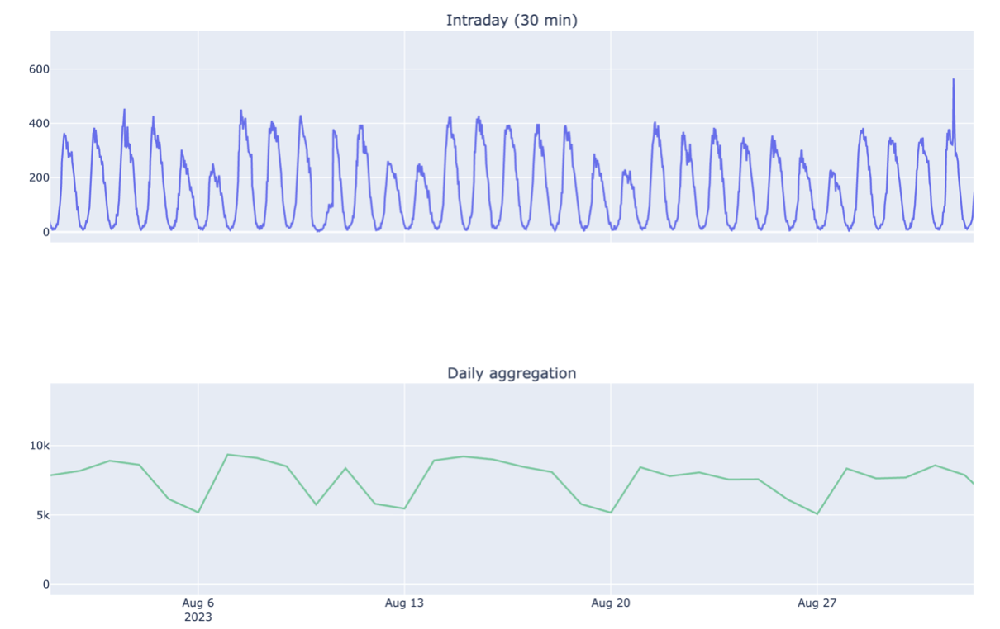
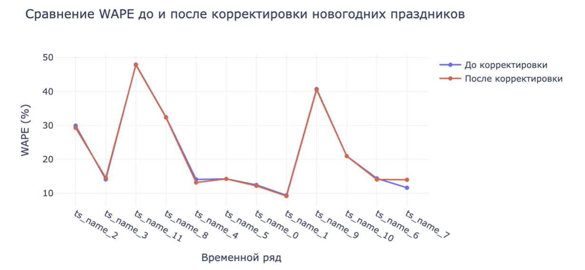
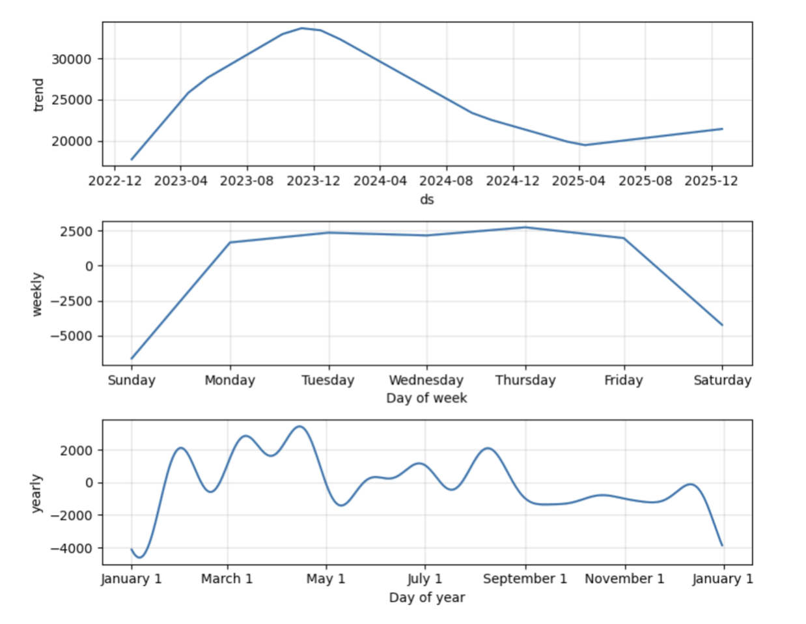
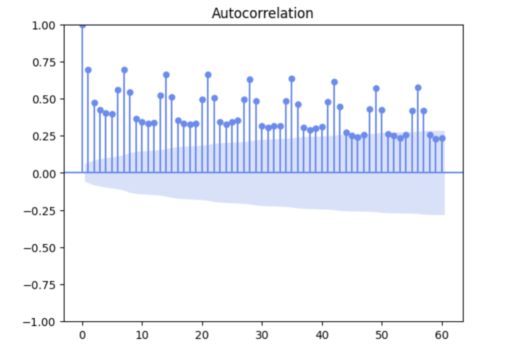
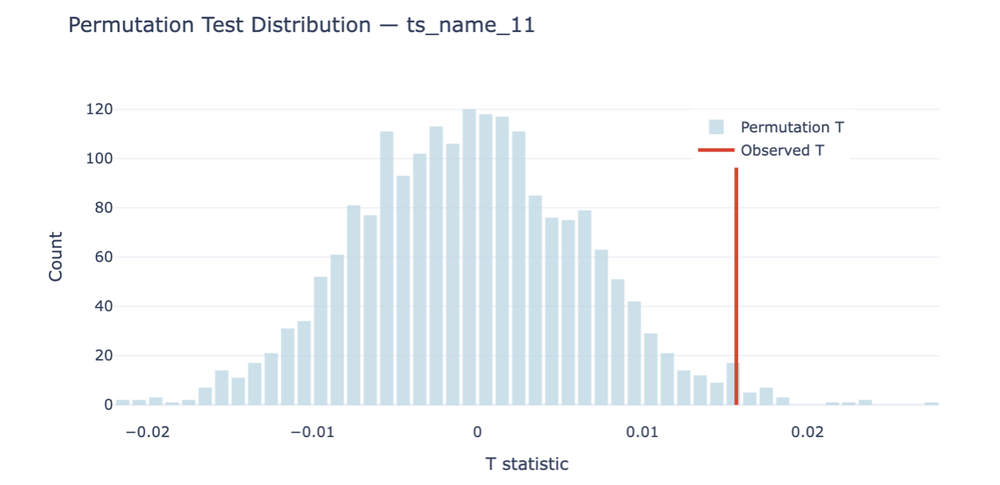
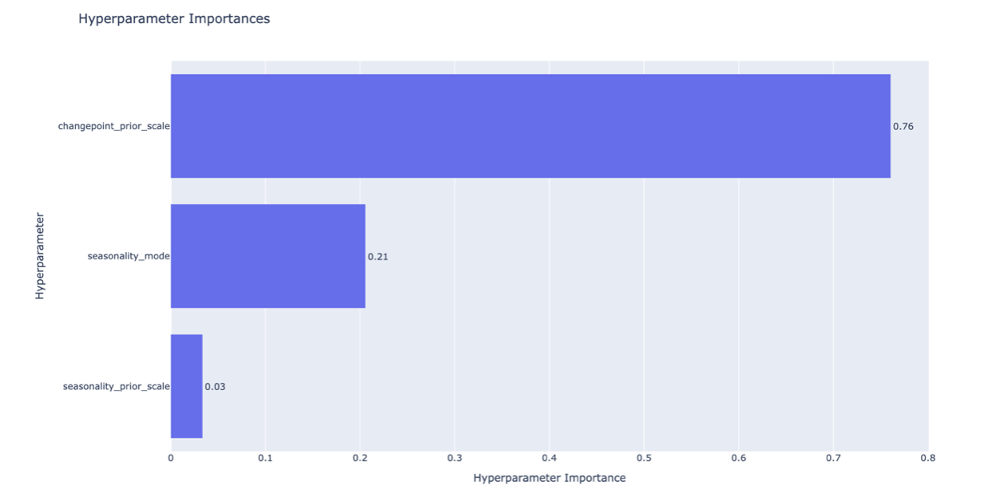
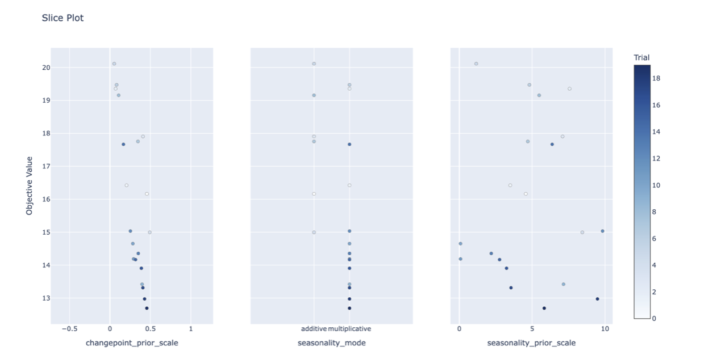
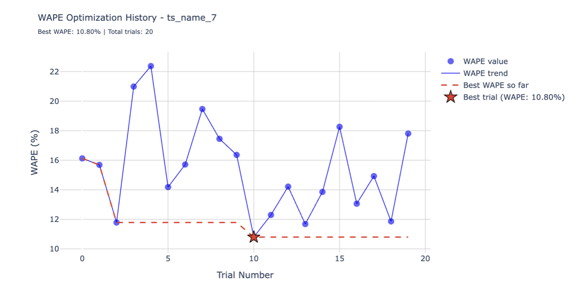
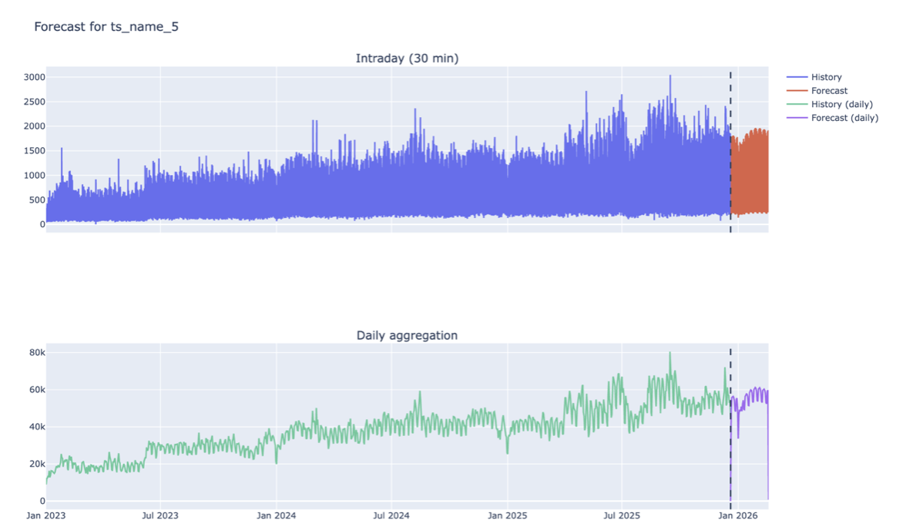

# Time Series Forecasting

Исследование методов прогнозирования временных рядов и разработка системы прогнозирования нагрузки на Python.

Проект выполнен в рамках курсовой работы на образовательной программе «Компьютерные науки и технологии» НИУ ВШЭ.

## О проекте

В проекте исследуются методы прогнозирования временных рядов нагрузки и реализуется единая система, которая выполняет полный цикл обработки данных — от предварительной подготовки временных рядов до построения и визуализации прогноза.

В качестве основной модели используется **Prophet**. Для повышения качества прогнозирования применяется автоматический подбор гиперпараметров с помощью **Optuna**. Особое внимание уделяется сезонным закономерностям, календарным факторам и внутридневному профилю нагрузки.

Изначальные данные представлены временными рядами с шагом **30 минут** за период с 01.01.2023 по 20.12.2025. Набор содержит 12 независимых временных рядов.

## Основные возможности

* предварительная обработка временных рядов;
* анализ внутридневной и недельной сезонности;
* учет календарных и праздничных факторов;
* построение прогноза с использованием Prophet;
* автоматический подбор гиперпараметров с помощью Optuna;
* оценка качества прогнозирования с использованием MAPE и WAPE;
* восстановление прогноза с дневного уровня до исходного 30-минутного интервала;
* отдельная корректировка прогноза для новогоднего периода;
* визуализация исходных данных и результатов прогнозирования;
* запуск системы через командную строку.

## Данные

Каждое наблюдение содержит три основных поля:

| Поле      | Описание                         |
| --------- | -------------------------------- |
| `dttm_30` | временная метка с шагом 30 минут |
| `y`       | значение нагрузки                |
| `ts_name` | идентификатор временного ряда    |

За одни сутки для каждого временного ряда формируется 48 наблюдений.

В процессе исследования было обнаружено различие между поведением нагрузки в рабочие, выходные и праздничные дни. Поэтому календарные факторы и сезонность учитываются непосредственно при построении прогноза.

## Подход

Общий pipeline системы:

```text
Исходные данные
      │
      ▼
Предварительная обработка
      │
      ▼
Анализ сезонности
      │
      ▼
Агрегация до дневного уровня
      │
      ▼
Prophet
      │
      ├── Optuna
      │
      ▼
Дневной прогноз
      │
      ▼
Восстановление 30-минутного профиля
      │
      ▼
Корректировка новогоднего периода
      │
      ▼
Оценка качества
      │
      ▼
Визуализация и сохранение результата
```

### Prophet

Prophet используется как основная модель прогнозирования благодаря возможности учитывать тренд, сезонные компоненты и влияние праздничных периодов.

Обучение модели выполняется на агрегированном дневном временном ряде. После получения дневного прогноза он преобразуется обратно к исходной 30-минутной частоте.

### Optuna

Для автоматического поиска параметров Prophet используется библиотека **Optuna**.

Оптимизация выполняется по значению **WAPE** на валидационной выборке. Для каждого временного ряда исследуется несколько наборов гиперпараметров, после чего выбирается конфигурация с наименьшей ошибкой.

### Восстановление внутридневного профиля

Поскольку исходные данные имеют 30-минутную частоту, после построения дневного прогноза необходимо восстановить внутридневную структуру нагрузки.




Для этого используется исторический профиль последних наблюдений: дневное прогнозное значение распределяется между 48 получасовыми интервалами в соответствии с характерным внутридневным профилем.

### Новогодняя корректировка

Новогодний период обладает характерным поведением, которое отличается от обычных рабочих и выходных дней.

Поэтому для 1–8 января применяется дополнительная корректировка прогноза на основе исторического поведения нагрузки в аналогичный период.




## Исследование

### Анализ сезонности

На первом этапе исследуются закономерности изменения нагрузки внутри суток и в течение недели.



Анализ сезонности используется при выборе компонентов модели и построении внутридневного профиля.

### Расчет автокоррелляционной функции 

Для проверки правильности выявления сезонностей была рассчитана автокоррелляционная функция




### Перестановочный тест

Для подтверждения статистической значимости сезонных различий применялся перестановочный тест. Предварительно для каждого дня рассчитывались среднее значение нагрузки, стандартное отклонение и нормализованные значения (z-преобразование); выходные и праздничные дни из анализа исключались.

Различия между сезонными профилями оценивались через попарные расстояния между наблюдениями. Тестовая статистика — разность между средним межгрупповым и средним внутригрупповым расстоянием. Далее метки месяцев многократно случайным образом перемешивались, после каждой итерации статистика пересчитывалась.




### Оптимизация гиперпараметров

Для подбора параметров Prophet применяется Optuna.








Оптимизация позволяет подобрать конфигурацию модели отдельно для каждого временного ряда с учетом качества прогноза на валидационной выборке.

### Результат прогнозирования

После прохождения всех этапов система формирует прогноз на исходном 30-минутном интервале.



На графике представлены исторические значения и полученный прогноз. Дневной прогноз Prophet дополнительно преобразуется во внутридневной профиль.

## Оценка качества

Для оценки качества прогнозирования используются две метрики:

* **MAPE** — средняя абсолютная процентная ошибка;
* **WAPE** — взвешенная абсолютная процентная ошибка.

Использование обеих метрик позволяет оценивать модель с разных сторон: MAPE показывает относительную ошибку отдельных наблюдений, а WAPE лучше отражает отклонение прогноза относительно общего объема нагрузки.

## Технологии

* Python
* Pandas
* NumPy
* Prophet
* Optuna
* Statsmodels
* Plotly
* SciPy
* Typer

## Запуск

Клонирование репозитория:

```bash
git clone https://github.com/nrmaryakhin/time-series-forecasting.git
cd time-series-forecasting
```

Создание виртуального окружения:

```bash
python -m venv .venv
```

Активация окружения:

```bash
source .venv/bin/activate
```

Установка зависимостей:

```bash
pip install -r requirements.txt
```

Запуск программы:

```bash
python forecast.py \
    --file-path data/dataset.csv \
    --steps-days 60 \
    --use-crossvalidation \
    --use-params-tuning
```


## Исследовательский ноутбук

Полное исследование, включая анализ данных, визуализации и промежуточные эксперименты, представлено в:

`/notebooks/seasons_upd.ipynb`

Основная программа содержит итоговую реализацию pipeline прогнозирования.

## Результат

В результате разработана система, которая объединяет предварительную обработку данных, исследование сезонности, прогнозирование с помощью Prophet, автоматический подбор параметров, восстановление внутридневного профиля и специальную обработку новогоднего периода.

Проект позволяет применять единый pipeline к нескольким независимым временным рядам и получать прогнозы на исходной 30-минутной частоте.
